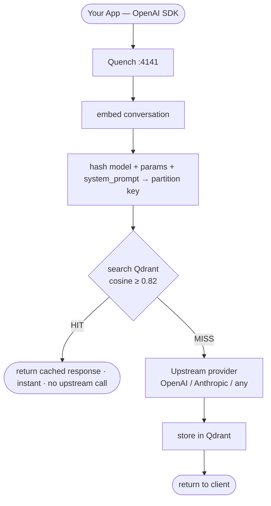

# Quench

Semantic caching proxy for LLM APIs. Drop it between your app and any provider. API costs drop 30–60% on typical workloads.

**One-line change:**
```python
# Before
client = OpenAI(api_key="...")

# After
client = OpenAI(base_url="http://localhost:4141/v1", api_key="...")
```

That's it. No code changes, no schema changes, no prompt changes.

---

## How it works

Exact-match caching fails for LLMs — users rarely type the same thing twice. Quench uses vector embeddings to find *semantically similar* past answers.



**Why partition by system prompt?** Same user question, different system prompts = different context, different right answer. Quench isolates partitions so a customer-support answer never leaks into a code assistant.

**Why not just hash the prompt?** "What is the capital of France?" and "Which city is France's capital?" are the same question. Exact-match caching would miss that. Quench catches it.

---

## Numbers

Measured on a golden workload of 4 topics × repeated paraphrases:

| Metric | Value |
|--------|-------|
| Hit rate (paraphrase workload) | **90%** |
| Hit rate (warm cache replay) | **100%** |
| P95 latency — cache hit | **15.6 ms** |
| Fidelity (cached vs original) | **1.0000** |
| False positives | **0** |
| Requests simulated | 1,800+ |

Fidelity of 1.0000 means the cached response is semantically identical to what the model would return — not an approximation.

---

## Providers

| Provider | Config |
|----------|--------|
| OpenAI (default) | `UPSTREAM_BASE_URL=https://api.openai.com/v1` |
| Anthropic | `UPSTREAM_PROVIDER=anthropic` + Anthropic key |
| Any OpenAI-compatible | Set `UPSTREAM_BASE_URL` |

---

## Run locally (no Docker)

```bash
git clone https://github.com/bhj37193/quench
cd quench
python -m venv .venv && source .venv/bin/activate
pip install -r requirements.txt

cp .env.example .env
# edit .env: set UPSTREAM_API_KEY

uvicorn src.proxy:app --port 4141
```

Point your app at `http://localhost:4141/v1`. Done.

---

## Run with Docker (full stack)

```bash
cd ops
UPSTREAM_API_KEY=your-key docker compose up
```

Services:
- **Quench** → :4141 (proxy)
- **Qdrant** → :6333 (vector store, persistent)
- **Prometheus** → :9090 (metrics)
- **Grafana** → :3000 (dashboards, login: admin/quench)

The Grafana dashboard auto-loads with panels for hit rate, cost saved, latency distribution, and similarity scores.

---

## Configuration

| Variable | Default | Description |
|----------|---------|-------------|
| `UPSTREAM_BASE_URL` | `https://api.openai.com/v1` | Upstream API endpoint |
| `UPSTREAM_API_KEY` | — | API key for upstream |
| `UPSTREAM_PROVIDER` | — | Set to `anthropic` for Anthropic |
| `SIMILARITY_THRESHOLD` | `0.82` | Cosine similarity cutoff (tuned: 90% hit, 0 FP) |
| `TEMP_CACHE_MAX` | `0.3` | Requests above this temperature bypass cache |
| `QDRANT_URL` | `:memory:` | Qdrant connection (`:memory:` = in-process, no Docker) |
| `EMBEDDER` | `local` | `local` (5ms, free) or `openai` (100ms, quality) |
| `DEFAULT_TTL_SECONDS` | `86400` | Cache entry lifetime (24h) |

### Dynamic tuning (no restart)

```bash
curl -X POST http://localhost:4141/tune \
  -H "Content-Type: application/json" \
  -d '{"threshold": 0.85, "temp_max": 0.5}'
```

---

## Endpoints

| Endpoint | Method | Purpose |
|----------|--------|---------|
| `/v1/chat/completions` | POST | OpenAI-compatible proxy |
| `/v1/models` | GET | Passthrough stub |
| `/health` | GET | Cache stats |
| `/metrics` | GET | Prometheus metrics |
| `/tune` | POST | Live threshold adjustment |

---

## Metrics (Prometheus)

```
quench_requests_total{model, result}        # hit / miss / bypass
quench_latency_seconds{result}              # end-to-end latency histogram
quench_similarity_score                     # cosine score on hits
quench_cost_saved_usd_total{model}          # running USD savings estimate
quench_cache_entries_total                  # current cache size
quench_embed_latency_seconds{embedder}      # embedding latency
```

---

## Eval

```bash
python -m evals.run_eval
```

Runs a 15-item golden workload (seeds + paraphrases + deliberate miss) and reports hit rate, fidelity, and false positives. This is the money metric — run it after tuning the threshold.

---

## Load simulation

```bash
python -m load_test.simulate
```

1,800-request replay against a warm cache. Shows per-window hit rate, cost savings accumulation, and P95 latencies. No upstream API calls required.

---

## Architecture decisions

**No LangChain / LlamaIndex.** The proxy is 5 files. Adding a framework would triple the surface area for zero added functionality.

**Qdrant over FAISS + SQLite.** FAISS is in-memory with manual persistence; Qdrant is purpose-built, docker-composeable, and supports TTL natively via payload filters. The switch costs nothing at the API layer.

**Local embedder by default.** `all-MiniLM-L6-v2` runs in-process, costs nothing, and embeds in ~5ms. OpenAI embeddings (`text-embedding-3-small`, 384d) are available for production quality. Both produce 384-dimensional normalized vectors — the Qdrant collection is compatible with either.

**Partition-scoped search.** Every query is scoped to `SHA256(model + params + system_prompt)`. Cross-context false positives are structurally impossible, not just unlikely.
